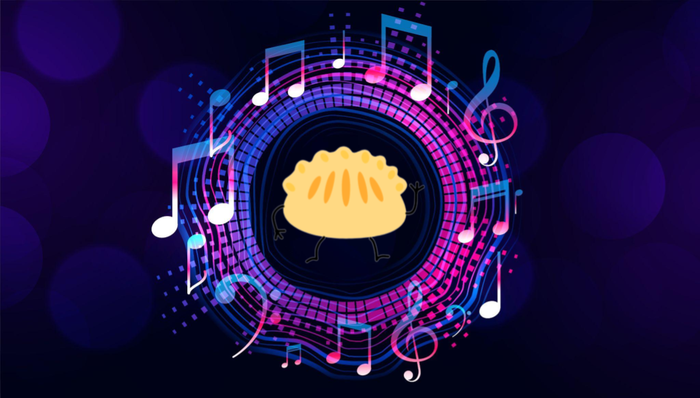

# DumplingBot - Discord Music Bot 

A Discord music bot that you can play music from in your Discord server. Easy to setup and you can run it by yourself.

    

## Features

### Music

1. Search online sources(Youtube, url) and play music.
2. Play music from local files.
3. Player operations(play, pause, resume, etc.)

### Greeting
1. Welcome messages to new members. 

## Getting Started
Invite bot to your discord server:

[Invite link](https://discord.com/api/oauth2/authorize?client_id=971060174511042560&permissions=8&scope=bot)

## Commands list

|Command|Arguement|Description|
|-------|---------|-----------|
|**Music**|
|!clear|N/A|Clear songs in queue|
|!join|N/A|Joins a voice channel|
|!now|N/A|Returns the song is currently playing|
|!pause|N/A|Pause playing music|
|!play |`<keywords>`|Plays by searching keywords on Youtube|
|!play_local|`<query>`|Plays a file from the local filesystem|
|!play_url |`<url>`|Plays from a url (almost anything youtube_dl supports)|
|!playlist|N/A|Displays songs in queue|
|!resume|N/A|Resume playing music|
|!skip|N/A|Skip current playing song to next one|
|!stop|N/A|Stops and disconnects the bot from voice|
|!volume |`<volume>`|Changes the player's volume|
|**Greetings**|
|!hi|N/A|Say "hi" to user|
|**Manager**|
|!delete|`<amount>`|Delete number of messages. (need permission to manage messages)|
|**No Category**|
|!help |[command]|Return command description|

